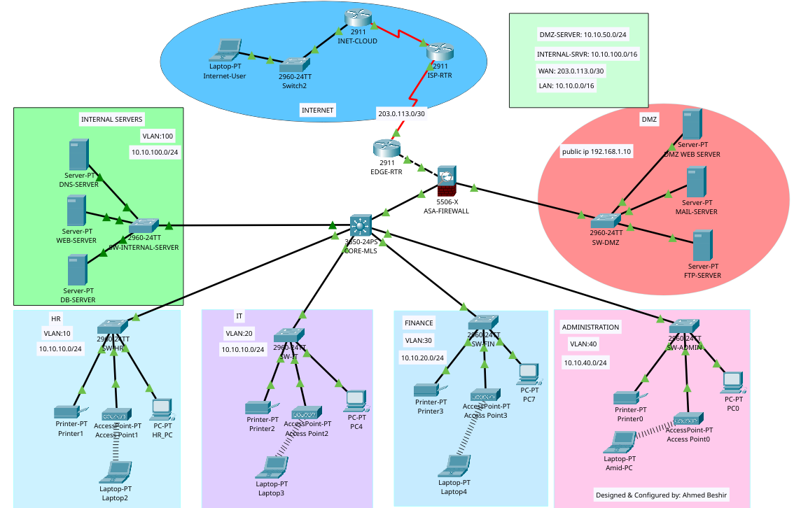
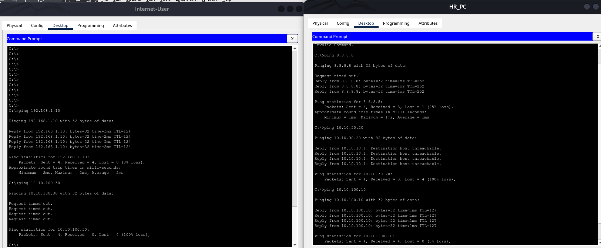

# Secure Enterprise Network Segmentation
 

## Overview

This project simulates a small enterprise network designed with security, segmentation, and controlled internet access in mind.

The goal of the project was to practice real-world networking concepts including:

- VLAN segmentation
- Inter-VLAN routing
- Firewall zone design
- DMZ architecture
- NAT and internet connectivity
- Access control and traffic filtering

This lab was created using Cisco Packet Tracer.

---
## Network Topology

## Network Architecture

The network is divided into several logical areas:

### Internal Departments (VLAN Segmentation)

Each department is placed in its own VLAN to reduce broadcast domains and improve security:

- VLAN 10 — HR
- VLAN 20 — IT
- VLAN 30 — Finance
- VLAN 40 — Administration

A multilayer core switch performs inter-VLAN routing and acts as the central routing point for internal traffic.

---

### Internal Server Network

Internal services such as DNS, Web, and Database servers are placed in a dedicated server VLAN.

Benefits:

- Easier traffic control
- Centralized service management
- Reduced exposure to user devices

---

### DMZ (Demilitarized Zone)

Public-facing servers are placed in a DMZ network connected to the ASA firewall.

I implemented the DMZ to simulate how organizations expose services externally while protecting internal resources. External traffic is allowed only to specific hosts and services through controlled firewall rules.

---

### Firewall and Security Zones

Cisco ASA firewall divides the network into security zones:

- Inside (trusted internal network)
- DMZ (semi-trusted zone)
- Outside (untrusted internet)

Traffic between zones is controlled using Access Control Lists (ACLs).

---

### Internet Connectivity

Traffic path:

Internal VLANs → Core Switch → ASA Firewall → Edge Router → ISP → Internet

NAT is configured on the ASA firewall so internal private addresses can access external networks.

---

## Security Design Principles

This lab includes several foundational security practices:

- VLAN-based network segmentation
- Trust zone separation using firewall interfaces
- Access Control Lists (ACLs) to restrict traffic
- DMZ isolation for externally accessible services
- Network Address Translation (NAT)
- Static routing with controlled default paths

While testing, I intentionally  traffic flows using traceroute and packet inspection to understand how packets move through security layers.

---

## Testing

The following tests were performed to validate routing, firewall behavior, and network segmentation.

### External → DMZ Access

From the simulated Internet side:

- Ping DMZ web server:

  ping 192.168.1.10

 **PASS** — DMZ server is reachable from outside as intended.
### External → Internal Network Access

From the simulated Internet side:

- Ping internal database/server:

  ping 10.10.x.x

 **FAIL** — Internal network is protected and not reachable from outside.

### Internal VLAN Connectivity

Test inter-VLAN routing from internal hosts.

Example:

- From VLAN 10 host:

  ping 10.10.30.x

 **PASS** — Internal routing through the core switch is working.

### Segmentation Enforcement

Attempt communication between restricted networks based on ACL policy.

Example:
HR_PC -> FINANCE

 **FAIL** — Traffic blocked according to security policy.
### Internal → Internet Access

From internal PC:

  ping 8.8.8.8

 **PASS** — Outbound internet connectivity works through NAT.

##### here on the image i have attached the test and results 

## What I Learned

This project helped me strengthen both my networking fundamentals and my security mindset through hands-on experimentation.

Some key things I practiced and understood better:

- Designing networks using VLAN segmentation instead of flat networks
- Configuring inter-VLAN routing on a multilayer switch
- Understanding how traffic actually flows hop-by-hop across devices
- Using a firewall to separate internal, external, and DMZ zones
- How NAT works in practice and how return traffic behaves
- Troubleshooting connectivity issues using ping, traceroute, and routing tables
- Thinking about security during design, not only after deployment

More than just configuration commands, this lab helped me see how routing, switching, and firewall behavior connect together to form a secure and functional network.

## 🔗 Connect with Me
If you are interested in networking, cybersecurity, or learning through hands-on labs, feel free to connect.

    
